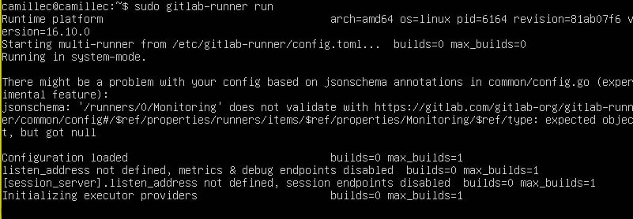

# CI/CD

## Part 1 Установка Girlab-Runner
- Целью задания было установить утилиту gitlab-runner на виртуальную машину ubuntu server 22.04 LTS.
    - Для начала установим все необходимые библиотеки для дальнейшей работы

        

    - Устанавливаем gitlab-runner на виртуальной машине при помоще следующих команд:

    

    - Затем прописываем `sudo apt install gitlab-runner`

    - Запускаем `sudo gitlab-runner register`
    

    Важно указать верный тэг для дальнейшей работы ы gitlab-runner, иначе цели не будут выполнены  утилита будет выдавать ошибку.
    
    - Запускаем `sudo gitlab-runner run`

    

## Part 2 Сборка
- Целью задания было написать этап для CI по сборке приложений из проекта C2_SimpleBashUtils:
    - В файле gitlab-ci.yml добавить этап запуска сборки через makefile из проекта C2. Файлы, полученные после сборки (артефакты), сохранять в произвольную директорию со сроком хранения 30 дней.
    
     

    Tag `simple_bash` был прописан мной при регистрации gitlab-runner
    
    
    *вывод результатов сборки*  

## Part 3 Тест кодстайла
- Целью задания было написать этап для **CI**, который запускает скрипт кодстайла (*clang-format*):
    - следующие изменения были внесены в .gitlab-ci.yml файл:
    
    
    
    - Скрин с 2 пайплайнами
    
    
    
    - вывод утилиты *clang-format* при зафейленном пайплайне:
    
    
    
    - вывод утилиты *clang-format* при успешном пайплане:
    
    

## Part 4. Интеграционные тесты
- Целью задания было написать этап для **CI**, который запускает интеграционные тесты из того же проекта:
    - следующие изменения были внесены в .gitlab-ci.yml файл:
    
    
    
    - Скрин с 2 пайплайнами
    
    
    
    - вывод интеграционных тестов при зафейленном пайплайне:
    
    
    
    - вывод интеграционных тестов при успешном пайплане:
    
    


### Part 5. Этап деплоя
- Целью задания было написать этап для **CI**, который запускает деплой приложений из проекта C2_SimpleBashUtils:
    - следующие изменения были внесены в .gitlab-ci.yml файл:
    
    
    
    - создаем вторую виртуальную машину, настраиваем параметры сети

    

    - проверяем, пингуются ли машины

    

    - создаем ssh ключ для второго пользователя в gitlab-runner на виртуальной машине S21_CI/CD и настроим доступ по ssh.
    ```
    sudo su gitlab-runner
    ssh-keygen -t rsa -b 2048
    ssh-copy-id camillec@192.168.100.11
    ssh  camillec@192.168.100.11
    ```
    - На виртуальной машине S21_DEPLOY так же создадим ключ и настроим доступ.
    ```
    ssh-keygen -t rsa -b 2048
    ssh-copy-id  camillec@192.168.100.10
    sudo chown -R $(whoami) /usr/local/bin
    ```
    - создаем bash скрипт deploy_script.sh:
    
    

    - пушим наш код с дополнением в виде deply_script.sh

    

### BONUS PART
- Целью задания было настроить уведомления об успешном/неуспешном выполнении пайплайна через бота с именем «[твой nickname] DO6 CI/CD» в *Telegram*.
    - зарегистрируем бота в телеграм 
    
    

    - напишем скрипт для нашего телеграм бота

    

    - добавим изменения на стадии deploy в .gitlab-ci.yml файл

    

    - пользуемся

    


