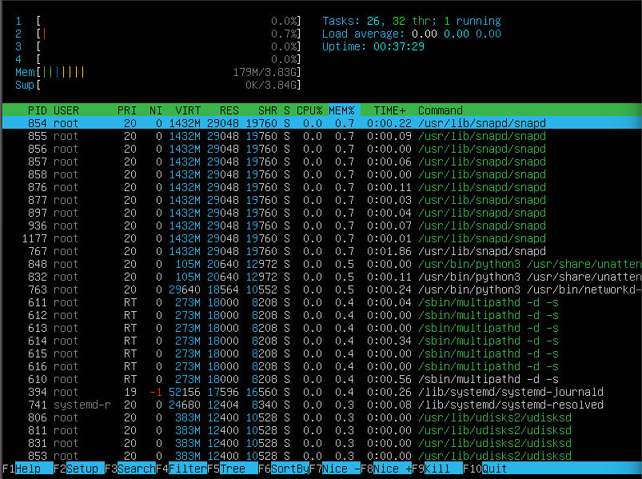
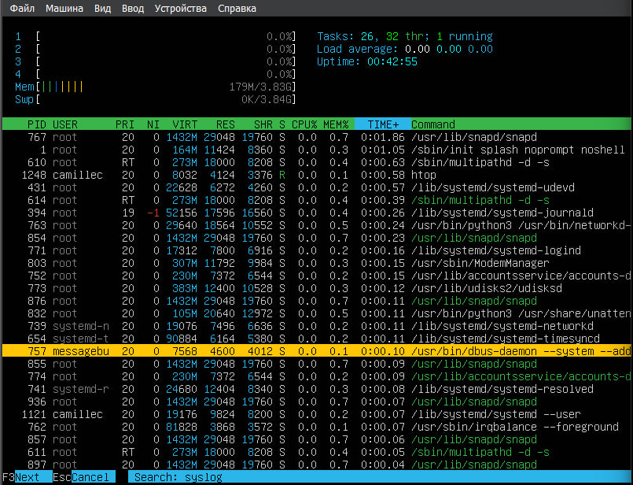

# Linux D01 отчет camillec

## Part 1. Установка ОС

- проверим версию Ubuntu с помощью `cat /etc/issue`.

## Part 2. Создание пользователя

- Создадим нового пользователя командой `sudo useradd (name)`.

- Добавим нового пользователя `sudo usermod -a -G adm (name)`.

- Проверим, что пользователь появился при вызове `cat /etc/passwd`.

## Part 3. Настройка сети ОС

- Установим имя машины с помощью `hostnamectl set-hostname 'new-hostname'`.
- Кроме того, можно изменить `/etc/hostname` файл.

- Установим временную зону `sudo timedatectl set-timezone Europe/Moscow`.

- Имена сетевых интерфейсов можно получить, посмотрев в */sys/class/net* или командой `ip -br a show`.
- `lo` или 'loopback device' - это специальный виртуальный сетевой интерфейс, который компьютер использует для связи с самим собой. Он используется в основном для диагностики и устранения неполадок, а также для подключения к серверам, работающим на локальной машине.

- Для получения IP-адреса устройства, с которым я работаю, воспользуюсь командой `sudo dhclient -v enpOs3`, `enpOs3` я обнаружил выше.

- DHCP - Dynamic Host Configuration Protocol.

- Получу внешний IP-адрес с помощью `curl ifconfig.me`.
- также можно использовать `wget -qO- eth0.me`.

- Получим информацию о внутреннем IP-адресе `ip route | grep default`.

- Чтобы изменить сетевые настройки (ip, gw, dns), нужно изменить файл */etc/netplan/00-installer-config.yaml*. Удалить параметр `dhcp4`. Добавить адреса.

- Сохраним настройки при помощи `sudo netplan apply`. Перезагрузим систему с помощью `sudo reboot` и затем проверим потерю пакетов при пинговании удаленных хостов 1.1.1.1 и ya.ru. Необходимо, чтобы было 0% потери пакетов. Сделаем это с помощью `hostname -I && ping -c 4 1.1.1.1 | grep "stat\|loss" && ping -c 4 ya.ru`

## Part 4. Обновление ОС

- Выполняем команду `sudo apt update` update. Увидим список доступных пакетов.

- Обновляем системные пакеты до последней версии `sudo apt full-upgrade`.
- Еще раз вызываем `sudo apt update`.

## Part 5. Использование команды sudo.

- Sudo (superuser «do») позволяет системному администратору делегировать полномочия, чтобы дать определенным пользователям (или группам пользователей) возможность запускать некоторые (или все) команды от имени пользователя root или другого пользователя, обеспечивая контрольный журнал команд и их аргументов.

- Разрешим пользователю `Arioh` использовать sudo - `sudo usermod -a -G sudo Arioh`
- Меняем пароль у Arioh - `sudo passwd Arioh`
- Меняем пользователя `su - Arioh`
- Меняем hostname - `sudo hostnamectl set-hostname newhost`
- Выводим результат - `cat /etc/hostname`

## Part 6. Установка и настройка службы времени

- Выведем текущее время - `date`

-Устанавливаем NTP - `sudo apt install ntpdate`.

- Активируем NTP - `sudo timedatectl set-ntp on`
- Выведем текущую дату и время снова - `timedatectl show`.

## Part 7. Установка и использование текстовых редакторов

- Установим MCEDIT - `sudo apt install mcedit`

- Скриншот из VIM. Для выхода и сохранения нажимаем ESC и затем вводим :wq (w-write, q-quit).

- Скриншот из NANO. Для выхода нажимаем CTRL+X и подтверждаем сохранение, введя Y(от слова Yes).

- Скриншот из MCEDIT. Чтобы выйти с сохранением нажимаем F2, подтвеждаем ENTER, затем F10.

- Скриншот из VIM с исправленной строкой. Чтобы выйти без сохранения, нажимаем ESC, затем вводим :q!.

- Скриншот из NANO с исправленной строкой. Для выхода нажимаем CTRL+X и НЕ подтверждаем сохранение, введя N.

- Скриншот из MCEDIT с исправленной строкой. Чтобы выйти без сохранения, нажимаем F10 и затем n.

- Поиск в VIM - `/camillec`

- Замена в VIM - `:s/camillec/21 School 21`

- Для поиска в NANO надо нажать сочетание CTRL+W. 

- Для замены в NANO нажимаем комбинацию CTRL+\, пишем слово, которое надо заменить, жмем ENTER, пишем слово, на которое надо заменить, жмем ENTER, подтверждаем, нажав Y.

- для поиска в MCEDIT нажимаем F7, вводим нужное слово, жмем ENTER, оно выделится зеленым.

- Для замены в MCEDIT жмем F4, вводим слово, которое хотим заменить, на второй строке слово, на которое хотим заменить, жмем ENTER, подтверждаем замену.

## Part 8. Установка и базовая настройка сервиса SSHD

- Устанавливаем службу SSHd - `sudo apt install openssh-server`.
- Проверяем ее наличие - `ssh -V`

- Добавляем автостарт службы SSHd - `sudo update-rc.d ssh defaults`.

- Открываем файл конфигурации - `sudo vim /etc/ssh/sshd_config`. Меняем в нем порт - заменяем строку `Port 22` на `Port 2022`.

- Чтобы изменения вступили в силу - `/etc/init.d/ssh restart`

- Проверим наличие процесса - `ps -axfv | grep sshd`.
- -a - убирает лидеры сеанса и процессы,связанные с терминалом
- -x - отображает только те процессы, которыми владеем
- -f - полноформатный список
- -v - версия 

- Перезагрузим систему - `sudo reboot`. 
- Установим netstat - `sudo apt install net-tools`. 
- Вызываем `netstat -tan` и проверяем, что существует `tcp 0 0.0.0.0:2022 0.0.0.0:* LISTEN`.
- -t - показывает только tcp соединения
- -a - показывает состояние всех сокетов
- -n - показывает IP вместо сетевого имени

#####Столбцы:
- Proto - протокол, используемый системой
- Recv-Q - кол-во байт, не копированных пользовательской программой, подключенной к этому сокету
- Send-Q - кол-во байт, которые отправлены и находятся в очереди на отправку для данного сокета
- Local Address - локальный адрес и номер порта сокета
- Foreign Address - внешний адрес и номер порта сокета
- State - состояние сокета

- 0.0.0.0 в выводе означает, что SSH Daemon прослушивает все интерфейсы IPv4, которые есть у машины

## Part 9. Установка и использование утилит top, htop

- Установим top и htop.

- Вызовем - `top`

1. Uptime: 22 min;

2. Кол-во авторизованных пользователей: 1;

3. Общая загрузка системы: 0.0%;

4. Общее кол-во процессов: 121;

5. Загрузка сpu: 0.0 (user(us)(0.0) + system(sy)(0.0))

6. Загрузка памяти: 178.8 used, 392,2 cache.

7. PID процесса, занимающего больше всего памяти: 832

8. PID процесса, занимающего больше всего процессорного времени: 216

- для выхода - `q`

- Запускаем `htop`.
- Для сортировки используем F6.

- Сортированная по PID

- Сортировка по PERCENT_CPU

- Сортировка по PERCENT_MEM

- Сортировка по TIME

- Для работы с фильтром нажимаем F4
- фильтр по SSHd

- Для работы с поиском - F3
- Поиск syslog.

- Чтобы добавить вывод - нажмем F2. Настраиваем и подтверждаем - F10.

## Part 10. Использование утилиты fdisk

- Запустим `fdisk -l`.

- Название: /dev/sda;
- Размер: 50GiB;
- Кол-во секторов : 104857600;
- swap размер (`free -h`): 3.8Gi.

## Part 11. Использование утилиты df

- Запустим `df`

- Размер пространства: 24590672.
- Места использовано: 7323640.
- Места свободно: 15992564.
- Процент использования: 32.
- Единицы измерения: Килобайты.

- Размер пространства: 24G.
- Места использовано: 7G.
- Места свободно: 16G.
- Процент использования: 32.

- Тип файловой системы - ext4

## Part 12. Использование утилиты du

- Запустим `du`

- Выведем размеры /home, /var, /var/log - `sudo du -s -h /home && sudo du -s -h /var && sudo du -s -h /var/log`

- Выведем размер всех элементов /var/log - `sudo du -s -h /var/log/*`.

## Part 13. Установка и использование утилиты ncdu

- Установим ncdu - `sudo apt install ncdu`.

- Размеры /home и /var

- Размер /var/log

## Part 14. Работа с системными журналами

- Смотрим `cat /var/log/dmesg`

- Смотрим `cat /var/log/syslog`

- Смотрим `cat /var/log/auth.log`

- Для просмотра последней авторизации - `last`.

- Время авторизации - Jan 5 18:54
- имя пользователя - camillec
- метод входа в систему - tty1

- Перезапускаем службу SSHd - `service sshd restart`
- Выводим сообщение о рестарте службы - `sudo cat /var/log/syslog

## Part 15 использование планировщика заданий CRON

- Установим CRON - `sudo apt install cron`.
- Планируем задачу - `crontab -e`.
- В VIM прописываем - `*/2 * * * * uptime`.

- Выведем текущие задачи - `crontab -l`

- Выводим системный журнал - `sudo grep CRON /var/log/syslog`

- Удаляем задачи - `crontab -r`
- Смотрим задачи еще раз - 'crontab -l'

