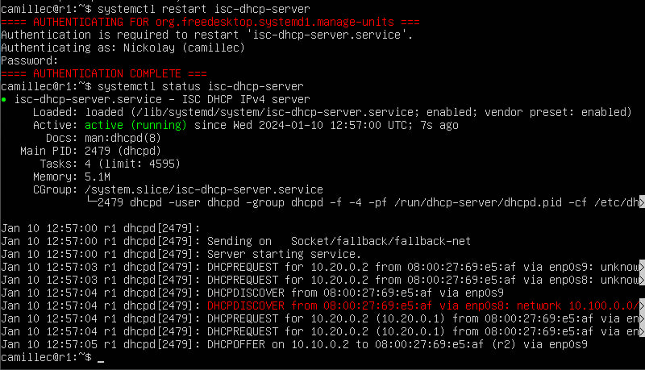
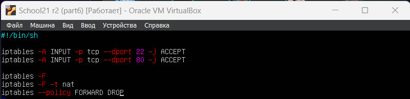

## Part 1. Инструмент ipcalc.
#### 1.1. Сети и маски

- Установим ipcalc - `sudo apt install ipcalc`
- Получим адрес сети - `ipcalc 192.167.38.54/13 | grep Network`

- Для перевода маски `255.255.255.0` в префиксную и двоичную - `ipcalc 255.255.255.0 | grep Netmask`. В префиксной записи `/24`, в двоичной - `11111111.11111111.11111111.00000000`
- Для перевода маски `/15` в обычную и двоичную - `ipcalc 0.0.0.0/15 | grep Netmask`. В обычной - `255.254.0.0', в двоичной - `11111111.11111110.00000000.00000000`

- Перевод маски `11111111.11111111.11111111.11110000`: в префиксной - `/28`, в обычной - `255.255.255.240`. Проверим - `ipcalc 255.255.255.240` | grep Netmask`.

- Найдем минимальный и максимальный хост в сети 12.167.38.4 при помощи `ipcalc 12.167.38.4(mask) | grep -e HostMin -e HostMax`. Маски - `/8`, `11111111.11111111.00000000.00000000`, `255.255.254.0`, `/4`

#### 1.2 localhost

- Для проверки используем `ping "IP"`
- 194.34.23.100 - нет
- 127.0.0.2 - да
- 127.1.0.1 - да
- 128.0.0.1 - нет

#### Диапазоны и сегменты сетей

- Все, что имет формат 10.\*.\*.\*, 172.16.\*.\*-172.31.\*.\* или 192.168.\*.\* - всегда частные. Остальные - публичные.

- 10.0.0.45 - частный
- 134.43.0.2 - публичный
- 192.168.4.2 - частный
- 172.20.250.4 - публичный
- 172.0.2.1 - публичный
- 192.172.0.1 - публичный
- 172.68.0.2 - публичный
- 172.16.255.255 - приватный
- 10.10.10.10 - частный
- 192.169.168.1 - публичный

- какие из перечисленных IP адресов шлюза возможны у сети 10.10.0.0/18

- 10.0.0.1 - нет
- 10.10.0.2 - да
- 10.10.10.10 - да
- 10.10.100.1 - нет
- 10.10.1.255 - да

## Part 2. Статическая маршрутизация между 2 машинами.

- Смотрим существующие сетевые интерфейсы - `ip a`

- Опишем сетевой интерфейс и зададим адреса и маски для обеих виртуальных машин - `vim /etc/netplan/00-installer-config.yaml`

- `sudo netplan apply`

#### 2.1 Добавление статического маршрута вручную

- Воспользуемся командой - `sudo ip r add (IP) via enp0s3
- Пропингуем соединение - `ping -c 4 (IP)`

#### 2.2 Добавление статического маршрута с сохранением

- Изменяем файлы конфигов

- Пропингуем

## Part 3. Утилита iperf3.
#### Скорость соединения

- 8 Mbps = 1 MB/s
- 100 MB/s = 819200 Kbps
- 1 Gbps - 1024 Mbps

#### Утилита iperf3

- Установим iperf3
- Измерим скорость соединения. Для этого на сервере пишем - `iperf3 -s`, на клиенте - `iperf3 -c (IP)`

## Part 4. Сетевой экран
#### Утилита iptables

- Создаем файл - `sudo touch /etc/firewall.sh`
- Открываем и редактируем - `sudo vim /etc/firewall.sh`.

- Добавляем разрешения - `sudo chmod +x /etc/firewall.sh`
- Запускаем - `sudo /etc/firewall.sh`
- Пингуем - `ping -c 4 1.1.1.1`
- Выводим статистику - `sudo iptables -L -v -n`. -L - это список правил, -v - подробный вывод (кол-во пакетов, байт), -n - отображение IP-адересов в числовом формате, а не в виде имени

- Разница в стратегиях заключается в том, что изза применения первого подходящего правила в первой стратегии сначала будет применяться запрещающее правило, и только те пакеты, которые пройдут, будут проверяться на разрешающее правило. Во второй стратегии наоборот. Таким образом, на выходе мы получим разные пакеты.

#### 4.2 Утилита nmap

- Находим не пингующуюся машину - ws1
- Вызываем `nmap (IP)`

- Сохраняем дампы

## Part5. Статическая маршрутизация сети

- Поднимаем 5 виртуальных машин

- Даем им имена - ws11, ws21, ws22, r1, r2

#### 5.1. Настройка адресов машин

- Изменим файлы `sudo vim /etc/netplan/00-installer-config.yaml`

- Применим конфиги - `sudo netplan apply`
- Выведем информацию - `ip -4 a`

- Пропингуем ws22 с ws21

- Пропингуем r1 c ws11

#### 5.2. Включение переадресации IP-адресов

- Включим переадресацию командой - `sudo sysctl -w net.ipv4.ip_forward=1`

- Изменим файл `/etc/sysctl.conf`

#### 5.3. Установка маршрута по умолчанию

- Изменим файл `/etc/netplan/00-installer-config.yaml`

- Вызовем - `ip r`

- Пропингуем ws11 с r2, на r2 вызовем `tcpdump -tn -i enp0s3`

#### 5.4. Добавление статических маршрутов

- Изменим файл `/etc/netplan/00-installer-config.yaml` для r1 и r2

- Применим правила и вызовем `ip r`

- Запустим на ws11 2 команды - `ip r list 10.10.0.0/18` и `ip r list 0.0.0.0/0`

- были выбраны отличные маршруты, так как в приоритетете всегда выбирается маршрут с более длинной маской - он дает более точное решение.

#### 5.5. Построение списка маршрутизаторов.

- На r1 - `sudo tcpdump -tnv -i enp0s3`

- На ws11 - `traceroute 10.20.0.10`

- Утилита traceroute отправляет 3 UDP-пакета (UPD - отправляет пакеты и не ждет ничего в ответ) вместо одного ICMP (протокол для передачи сообщений об ошибок) запроса. После этого он ожидает ответа о недоступности определенного порта целевого хоста. Пакеты отправляются с порядковым номером (первый пакет с TTL=1, второй с TTL=2 и т.д.). Так как отправляется UDP, то в нем есть порт отправителя, и порт получателя. По умолчанию этот порт - 34434. Когда адрес попадает на нужный хост, хост отправит ошибку недоступности порта ('Destination port unreacheble') - мы видим, что адресат получил запрос. Для traceroute - это знак завершения работы.

#### 5.6. Использование протокола ICMP при маршрутизации.

- Запустим на r1 - `tcpdump -n -i enp0s3 icmp`
- На ws1 запустим - `ping -c 1 10.30.0.111`

- Сохраним дампы виртуальных машин

## Part 6. Динамическая настройка IP с помощью DHCP

- Настроим службу DHCP для r2 - `sudo vim /etc/dhcp/dhcpd.conf`

- `sudo apt install isc-dhcp-server`

- `subnet 10.100.0.0 netmask 255.255.0.0` - описание подсети с IP адресом и маской подсети. В фигурных скобках - дополнительные настройки (конкретно для данной подсети их нет).
- `range 10.20.0.2 10.20.0.50` - указывает диапазон IP-адресов, которые DHCP может назначит клиентам в этой подсети (от 10.20.0.2 до 10.20.0.50)
- `option routers 10.20.0.1` - указывает адрес шлюза по умолчанию (маршрутизатора)
- `option domain-name-servers 10.20.0.1` -  указывает IP-адрес сервера DNS для этой сети

- Открываем `sudo vim /etc/resolv.conf` и меняем nameserver >> 8.8.8.8

- Перезагружаем службу DHCP - `sudo systemctl restart isc-dhcp-server`

- Проверим ws1 - `ip a`

- Пропингуем ws22 с ws21

- Укажем MAC адрес у ws11 - `sudo vim /etc/netplan/00-installer-config.yaml`

- Настроим и запустим DHCP на r1

- Выведем IP для ws11 и пропингуем ws22

- Запросим обновление адреса для ws21 - `sudo dhclient`

- Сохраним дампы образов виртуальных машин

## Part 7. NAT.

- Изменяем файл `/etc/apache2/ports.conf`

- Запускаем веб-сервер Apache - `service apache2 start`

- Добавляем в фаервол правила

- Не пингуется

- Меняем файл `/etc/firewall.sh`

- Пингуем

- Меняем файл `/etc/firewall.sh`

- Проверяем соединение

- Создаем дампы

## Part 8. Дополнительно. Знакомство с SSH Tunnels.

- Запускаем на r2 фаервол

- Запускаем веб-сервер Apache только на localhost

- Воспользуемся Local TCP forwarding с ws21 до ws22 - `ssh -L 9999:localhost:80 10.20.0.20`

- Воспользуемся Remote TCP forwarding с ws11 до ws22 - для этого в терминале ws22 пишем `ssh -R 8888:localhost:80 10.10.0.2`

- Проверим подключение - `telnet 127.0.0.1 8888 (или 9999)`

- Создадим дампы машин

