# Simple Docker

## Part 1. Готовый докер

- Выкачиваем докер-образ nginx - "docker pull nginx"
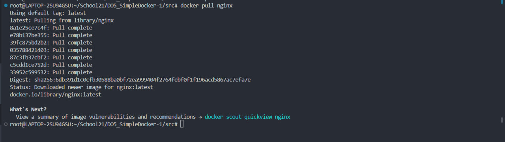  

- Проверяем наличие докер образа - "docker images | grep nginx"
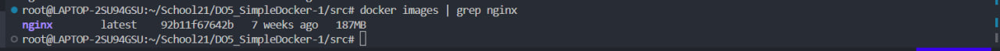  

- Запустим образ при помощи "docker run -d nginx", затем проверим, что образ запустился - "docker ps"
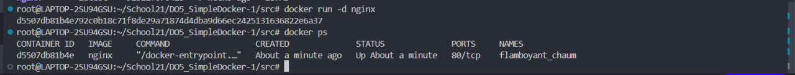  

- Посмотрим информацию о контейнере - "docker inspect \$(docker ps | grep nginx | awk '{print $1}')"
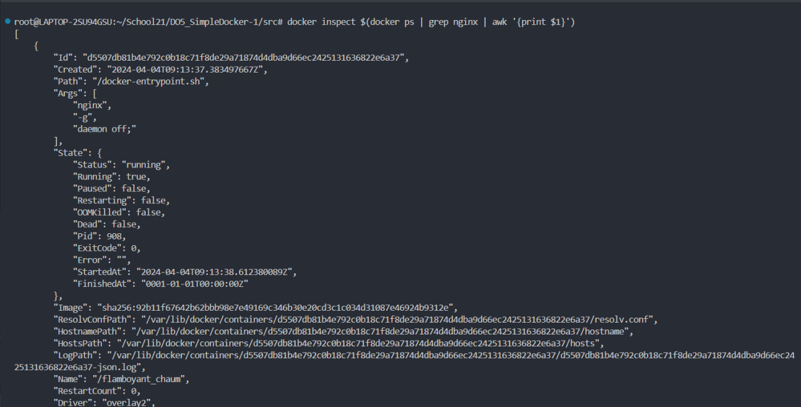  

- Параметры:
 -- размер контейнера - 67108864
 -- список портов - 80/tcp
 -- IP - 172.17.0.2

- Остановим образ - "docker stop \$(docker ps | grep nginx | awk '{print $1}')"
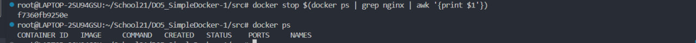  

- Запустим докер с портами 80 и 443 - "docker run -d -p 80:80 -p 443:443 nginx".
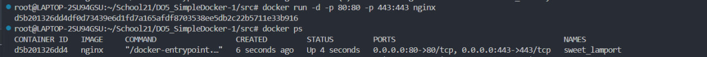  

- Убедимся, что по local:80 открывается nginx - "curl localhost:80"
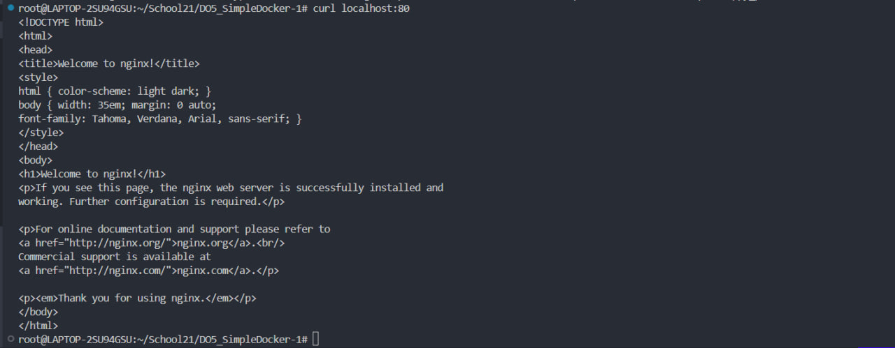  

- Перезапустим контейнер при помощи "docker restart \$(docker ps | grep nginx | awk '{print $1}')". Убедимся, что он заработал - "docker ps".
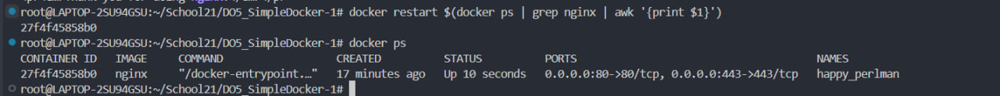  

## Part 2. Операции с контейнером

- Прочитаем конфигурационный файл - "docker exec nginx.conf"
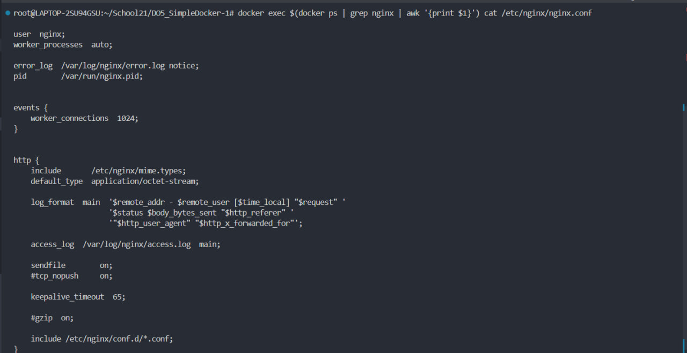  

- Создаем файл nginx.conf - "mkdir part2 && touch part2/nginx.conf"
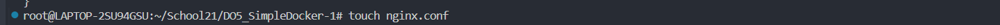  

- Настраиваем в нем по пути /status отдачу страницы статуса nginx
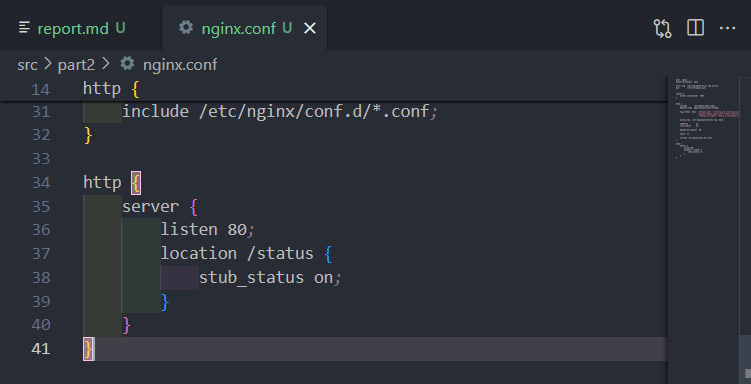  

- копируем файл nginx.conf в образ докера - "docker cp part2/nginx.conf \$(docker ps | grep nginx | awk '{print $1}'):etc/nginx"
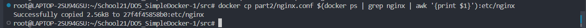  

- Перезапускаем контейнер - "docker exec \$(docker ps | grep nginx | awk '{print $1}') nginx -s reload"
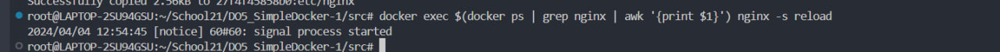  

- Смотрим статус сервера nginx - "curl localhos:80/status"
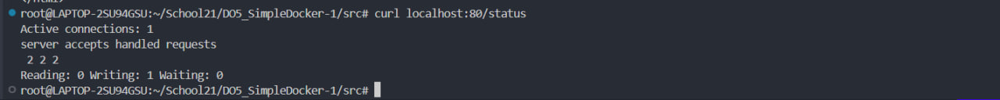  

- Экспортируем контейнер в архив - "docker export \$(docker ps | grep nginx | awk '{print \$1}') > container.tar". Останавливаем контейнер - "docker stop \$(docker ps | grep nginx | awk '{print $1}')". Удаляем образ - "docker rmi -f nginx"
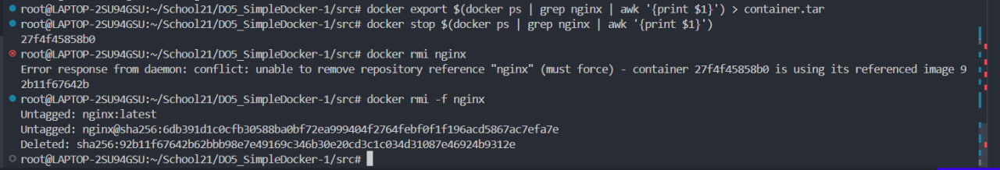  

- Удаляем контейнер 
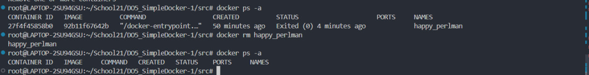  

- Импортируем контейнер - "docker import -c 'cmd ["nginx","-g","daemon off;"]' -c 'ENTRYPOINT ["\docker-entrypoint.sh"]' con
tainer.tar nginx". Выводим список образов. Запустим контейнер
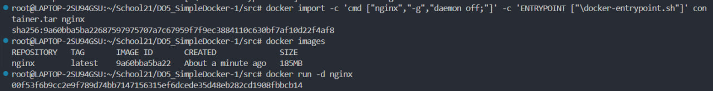  

- Проверяем, что отдается страничка со статусом
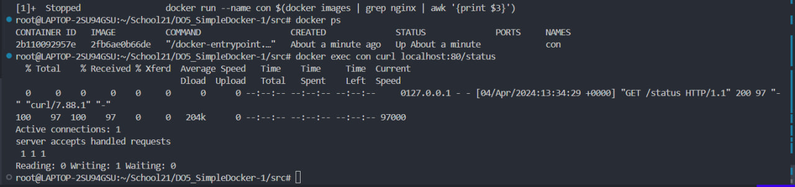  

## Part3. Мини веб-сервер

- Создаем файл server.c, пишем в нем "Hello_world"
- Копируем файл в контейнер - "docker cp server.c con:home"
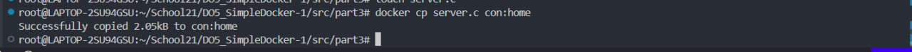  

- Меняем файл nginx.conf
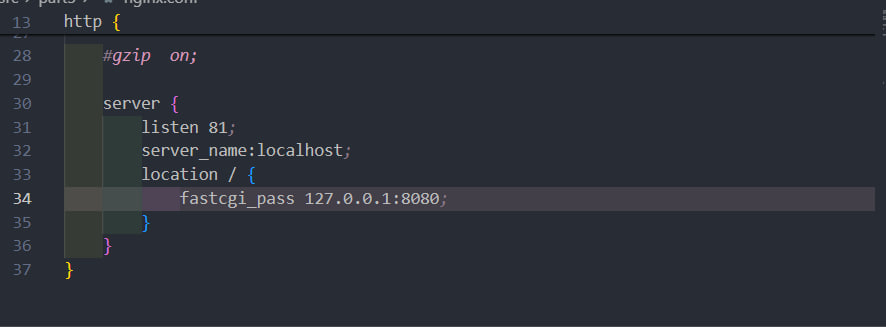  

- Копируем его в контейнер. Заходим в оболочку Bash контейнера, обновляем репозитории, скачиваем необхоимые библиотеки.
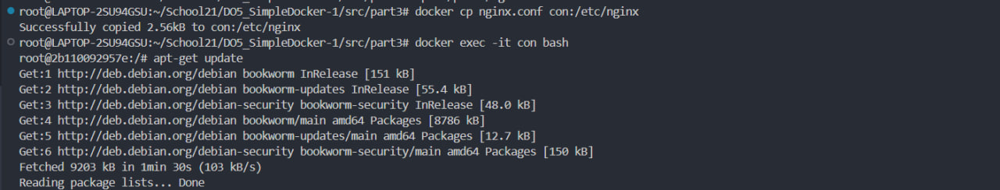  
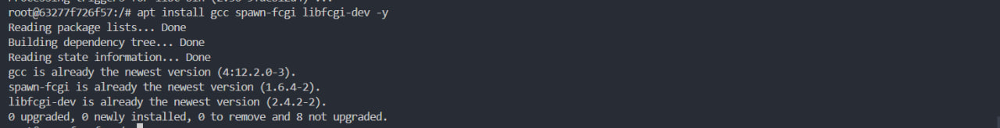  

- Компилируем, запускаем сервер, перезагружаем образ
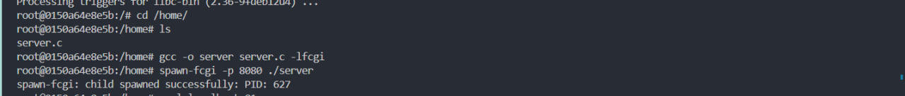  
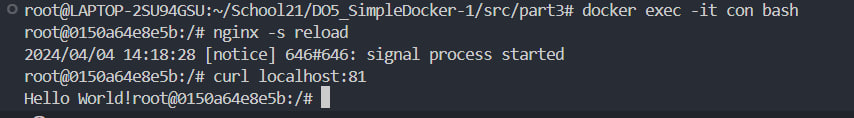  

- Открываем localhost:81
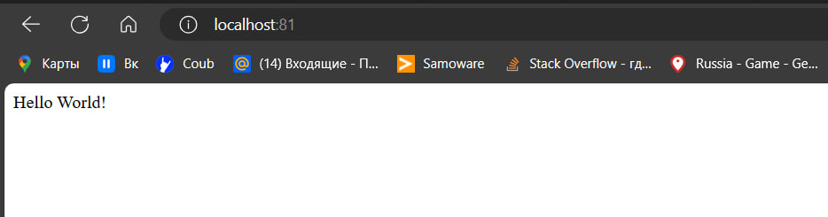  

## Part 4. Свой докер

- Создаем Dockerfile
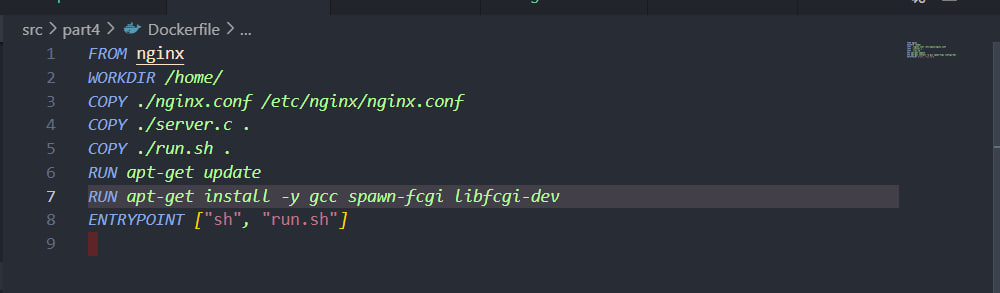  

- Создаем скрипт, выполняющий роль ENTRYPOINT
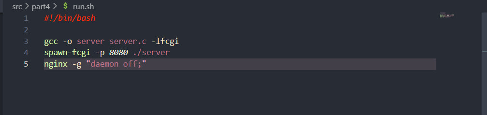  

- Собираем образ докера, используя имя и тег - camillec(имя):1.0(тег)
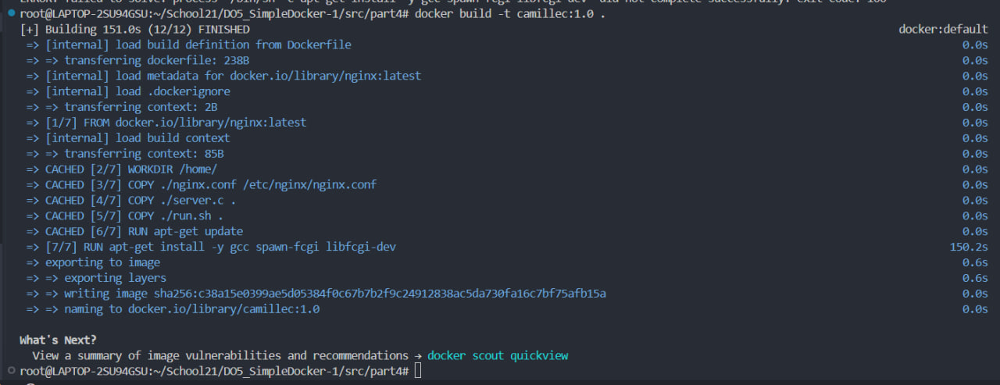  

- Проверяем наличие докер образа
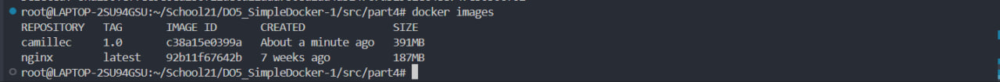  

- Запускаем собранный докер образ с маппингом 81 порта на 80 на локальной машине и маппингом папки Nginx внутрь контейнера по адресу /etc/nginx/. Проверяем ответ сервера
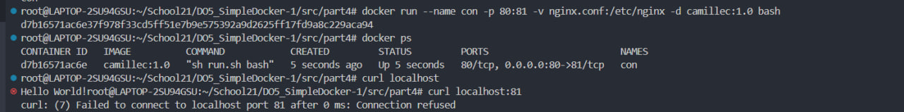  

## Part 5. Dockle.

- Устанавливаем Dockle - `VERSION=$(curl --silent "https://api.github.com/repos/goodwithtech/dockle/releases/latest" | \
 grep '"tag_name":' | \
 sed -E 's/.*"v([^"]+)".*/\1/' \
) && curl -L -o dockle.deb https://github.com/goodwithtech/dockle/releases/download/v${VERSION}/dockle_${VERSION}_Linux-64bit.deb
$ sudo dpkg -i dockle.deb && rm dockle.deb`

- Проверяем докер образ с помощью Dockle
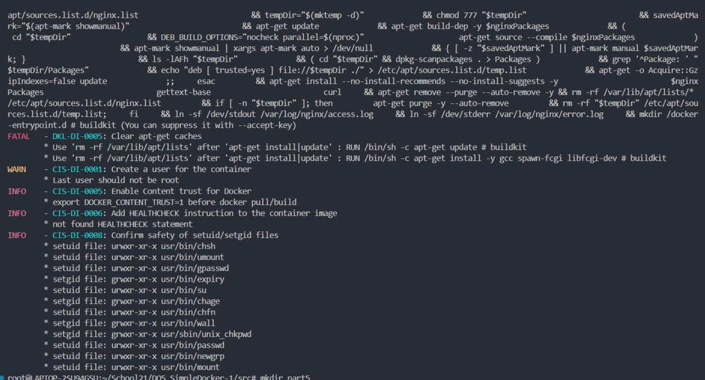  

- Исправляем Dockerfile, чтобы убрать все ошибки
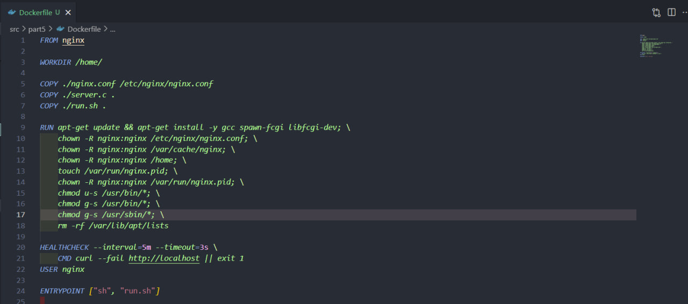  

-  Собрал докер образ
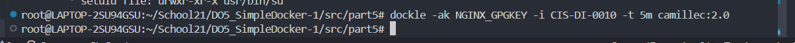  

- Запустил Dockle
  

## Part 6. 

- Копируем из Part все файлы в папку server без изменений. Создаем файл docker-compose.yml и меняем nginx,conf и run.sh
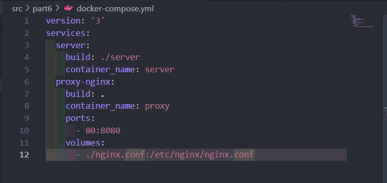  
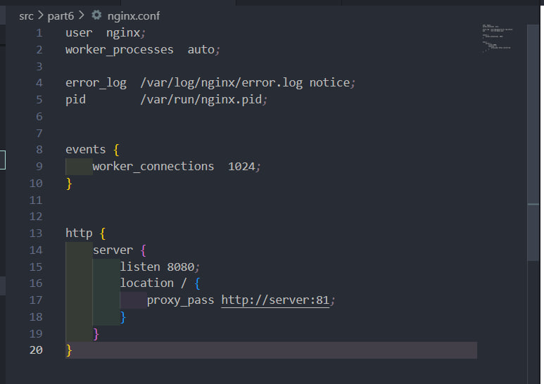  
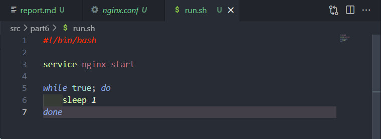  

- Соберем проект командой - "docker-compose build"
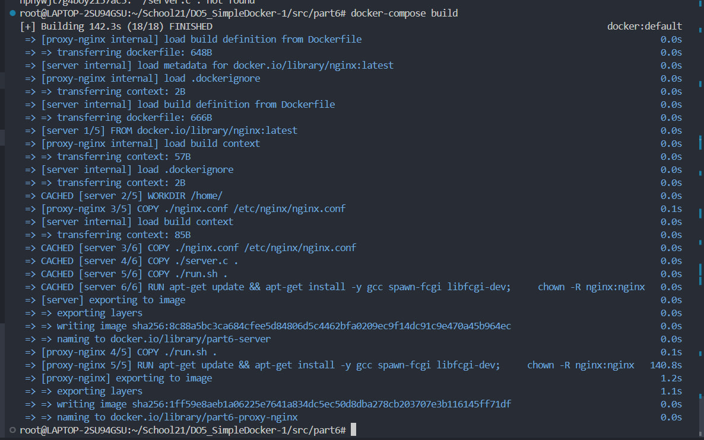  

- Запустим проект командой - "docker-compose up"
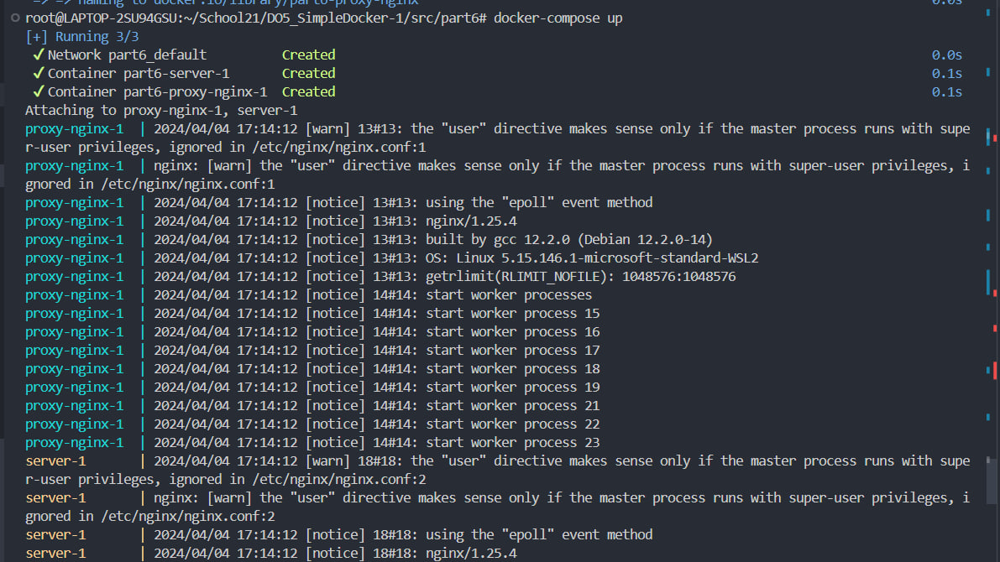  

- Проверим, что возвращается страница
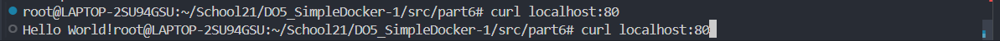  

